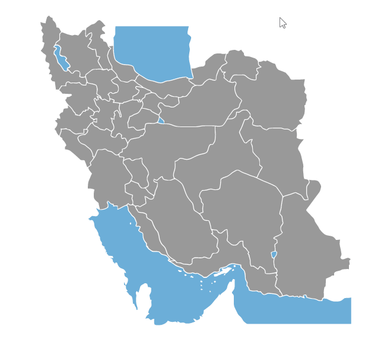

# Iran Map

[](https://github.com/masoudnemati/iran-map) &nbsp;  &nbsp;   

 &nbsp;  &nbsp;   

This project is responsive interactive **Iran map** including province and cities name made with _React_.  

[](https://masoudnemati.github.io/iran-map/)  
  


### Start in Development Mode

```bash
npm install
npm start
```

Runs the app in the development mode.
Open http://localhost:3000 to view it in the browser.

The page will reload if you make edits.
You will also see any lint errors in the console.

### Build instructions

```bash
npm install
npm build
```

Builds the app for production to the build folder.
It correctly bundles React in production mode and optimizes the build for the best performance.

The build is minified and the filenames include the hashes.
Your app is ready to be deployed!

### Contributing

Want to help ? See open issues and [contribute guide](CONTRIBUTING.md).


### License

Released under [MIT](/LICENSE.txt) by [@masoudnemati](https://github.com/masoudnemati).
